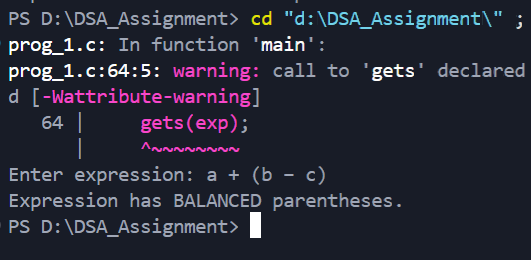

## Checking Balanced Parentheses Using Stack

---

### Aim

To write a program that checks whether a given mathematical expression contains a **balanced number of parentheses** using the **stack data structure**.

---

### Theory

A **stack** is a linear data structure that follows the **Last In First Out (LIFO)** principle.
Balanced parentheses mean:

* Every opening bracket has a corresponding closing bracket.
* Brackets are closed in the correct order.

Stacks are well suited for this problem because the most recent opening bracket must be closed first.

---

### Data Structure Definition

```c
typedef struct {
    char data[MAX];
    int top;
} Stack;
```

**Description:**

* `data[MAX]` : Array used to store opening brackets.
* `top` : Indicates the index of the topmost element.
* `typedef` : is used to simplify stack usage throughout the program.

---

### Description of Functions

* `initStack()` : Initializes the stack by setting `top = -1`
* `push()` : Inserts an opening bracket into the stack
* `pop()` : Removes and returns the top element from the stack
* `isMatching()` : Checks whether opening and closing brackets match
* `isBalanced()` : Determines whether the expression is balanced

---

### Algorithm 

1. Initialize the stack.
2. Scan the expression character by character.
3. Push opening brackets onto the stack.
4. On encountering a closing bracket:

   * Pop from stack
   * Check for correct matching.
5. After scanning:

   * Empty stack → Balanced
   * Non-empty stack → Unbalanced

---

### Description of `main()` Function

The `main()` function:

1. Accepts a mathematical expression as input.
2. Calls `isBalanced()` to verify parentheses.
3. Displays whether the expression is **balanced or unbalanced**.

---

### Sample Output

**A:**


**B:**


**C:**


---

### Result

The program successfully checks whether a given mathematical expression has balanced parentheses using a stack.

---

### Conclusion

This experiment demonstrates the practical application of the **stack data structure** for solving real-world problems. The program effectively uses structures, typedef, and stack operations to ensure correctness and clarity.

---
