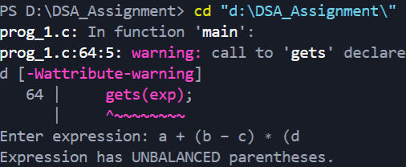

# Balanced Parentheses Check in C

---

### Aim

To write a program in C to **check whether an expression has balanced parentheses** using a stack.

---

### Theory

Balanced parentheses mean every **opening bracket** has a corresponding **closing bracket** in the correct order.  

Types of brackets:

- `()` : Round brackets  
- `{}` : Curly braces  
- `[]` : Square brackets  

**Stack Data Structure** is ideal for this problem because it follows **LIFO (Last In, First Out)**:

- Push opening brackets onto the stack.
- Pop from the stack when a closing bracket is encountered.
- The expression is balanced if the stack is empty after processing all characters.

---

### Data Structure / Stack Definition

```c
#define MAX 100

typedef struct {
    char data[MAX];
    int top;
} Stack;
````

* `data[]`: Array to store stack elements.
* `top`: Index of the top element in the stack.

---

### Definition of Program

The program performs the following operations:

1. Reads an expression from the user.
2. Iterates through each character:

   * Pushes **opening brackets** onto the stack.
   * Pops the stack when encountering **closing brackets** and checks for matching.
3. After processing all characters, checks if the stack is empty:

   * If yes → Expression is balanced.
   * If no → Expression is unbalanced.

Functions used:

* `initStack(Stack *s)`: Initializes the stack.
* `push(Stack *s, char ch)`: Pushes a character onto the stack.
* `pop(Stack *s)`: Pops a character from the stack.
* `isMatching(char open, char close)`: Checks if a pair of brackets match.
* `isBalanced(char exp[])`: Returns 1 if balanced, 0 if unbalanced.

---

### Algorithm

1. Initialize an empty stack.
2. For each character in the expression:

   * If it is an opening bracket, push it onto the stack.
   * If it is a closing bracket:

     * If the stack is empty → Not balanced.
     * Pop from the stack and check if it matches the closing bracket.

       * If not matching → Not balanced.
3. After processing all characters:

   * If stack is empty → Balanced.
   * Else → Unbalanced.

---

### Sample Output

**A:**


**B:**


**C:**


---

### Result

The program successfully checks whether a given expression has **balanced parentheses** using a stack.

---

### Conclusion

Using a stack provides an efficient and reliable way to check **balanced parentheses**. This method ensures correct pairing and nesting for multiple types of brackets in an expression.

---