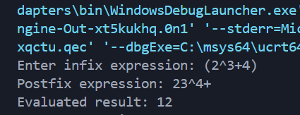
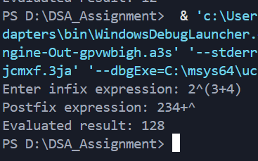

## Infix to Postfix Conversion and Evaluation Using Stack

---

### Aim

To write a program that **converts an infix mathematical expression into postfix form** and **evaluates the postfix expression** using the **stack data structure**, supporting all basic arithmetic operations including **exponentiation (`^`)**.

---

### Theory

An **infix expression** represents operators placed **between operands** (e.g., `A + B`).

A **postfix expression** (Reverse Polish Notation) places operators **after operands** (e.g., `AB+`).

Stacks follow the **Last In First Out (LIFO)** principle, making them ideal for:

* Handling **operator precedence**
* Managing **parentheses**
* Evaluating postfix expressions efficiently

The **operator precedence order** is:

```
^   (Highest, Right-Associative)
* / (Medium, Left-Associative)
+ - (Lowest, Left-Associative)
```

Parentheses `()` **always override precedence**, ensuring operations inside them are performed first.

---

### Data Structure Definition

```c
typedef struct {
    char data[MAX];
    int top;
} CharStack;

typedef struct {
    int data[MAX];
    int top;
} IntStack;
```

**Description:**

* `CharStack` : Stores operators and parentheses during infix to postfix conversion
* `IntStack` : Stores operands during postfix evaluation
* `data[MAX]` : Array representing stack elements
* `top` : Index of the topmost element
* `typedef` : Simplifies stack usage in the program

---

### Description of Functions

* `initCharStack()` : Initializes the operator stack
* `initIntStack()` : Initializes the operand stack
* `pushChar()` / `popChar()` / `peekChar()` : Basic operations on the operator stack
* `pushInt()` / `popInt()` : Basic operations on the operand stack
* `precedence()` : Returns precedence of a given operator
* `power()` : Computes integer exponentiation
* `infixToPostfix()` : Converts infix expression to postfix using stack rules and operator precedence
* `evaluatePostfix()` : Evaluates the postfix expression using an operand stack

---

### Algorithm

#### Infix to Postfix Conversion

1. Initialize the operator stack.
2. Scan the infix expression from left to right.
3. If the symbol is an operand, append it to postfix.
4. If the symbol is `(`, push it onto the stack.
5. If the symbol is `)`, pop all operators until `(` is encountered.
6. If the symbol is an operator:

   * Pop operators from the stack with **higher precedence**
   * Pop operators with **equal precedence if the current operator is left-associative**
   * Push the current operator onto the stack.
7. After scanning, pop any remaining operators to postfix.

---

#### Postfix Evaluation

1. Initialize the operand stack.
2. Scan the postfix expression from left to right.
3. If the symbol is an operand, push it onto the stack.
4. If the symbol is an operator:

   * Pop two operands from the stack
   * Apply the operator (`+ - * / ^`)
   * Push the result back onto the stack
5. The final stack value is the evaluated result.

---

### Description of `main()` Function

The `main()` function:

1. Accepts a **mathematical infix expression** from the user.
2. Converts the infix expression into **postfix** form using `infixToPostfix()`.
3. Evaluates the postfix expression using `evaluatePostfix()`.
4. Displays the **postfix expression** and the **evaluated result**.

---

### Sample Output

**A:**


**B:**


---

### Result

The program successfully converts any valid **infix expression** into postfix form and evaluates it correctly, even for **exponentiation** and **complex parentheses** expressions, using stack operations.

---

### Conclusion

This program demonstrates the **power of stacks** for expression processing. By combining:

* **operator stack** for precedence handling,
* **operand stack** for evaluation, and
* **right-associative handling for `^`**,

the program ensures **accurate expression evaluation**. The implementation is robust and can handle **large integer results safely** using `int`.

---
