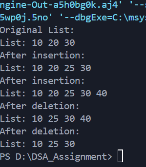

# Implementation of Doubly Linked List Using typedef Structure

---

### Aim

To implement a **doubly linked list** using `typedef` structure in C and to write functions to:

1. Insert a node after a given node
2. Delete a specified node
   The program demonstrates all operations using function calls.

---

### Theory

A **doubly linked list** is a dynamic data structure consisting of nodes where each node contains:

* `data` – stores the value of the node
* `prev` – pointer to the previous node in the list
* `next` – pointer to the next node in the list

This structure allows traversal in both **forward and backward directions**, and supports operations such as insertion and deletion at any position.

---

### Data Structure Definition

```c
typedef struct Node {
    int data;
    struct Node* prev;
    struct Node* next;
} Node;
```

**Description:**

* `Node` : Represents a single element of the doubly linked list
* `data` : Stores the integer value of the node
* `prev` : Pointer to the previous node in the list
* `next` : Pointer to the next node in the list
* `typedef` : Simplifies usage of the node structure in the program

---

### Description of Functions

* `createNode(int value)` : Creates a new node with the given value and returns a pointer to it.
* `insertAfter(Node* prevNode, int value)` : Inserts a node **after a given node** in the list.
* `deleteNode(Node** head, Node* delNode)` : Deletes a specific node from the list.
* `printList(Node* head)` : Displays the linked list in **forward order**.

---

### Algorithm

#### Insertion After a Given Node

1. Check if the given node is `NULL`. If yes, return.
2. Create a new node with the given value.
3. Set the new node's `next` to the given node's `next`.
4. Set the new node's `prev` to the given node.
5. Update the `prev` pointer of the next node if it exists.
6. Update the given node's `next` pointer to the new node.

#### Deletion of a Node

1. Check if the node to delete is `NULL`. If yes, return.
2. If the node is the head, update the head pointer.
3. Update the `prev` pointer of the next node if it exists.
4. Update the `next` pointer of the previous node if it exists.
5. Free the memory allocated to the node.

---

### Sample Output



---

### Result

The program successfully implements a **doubly linked list** with insertion and deletion operations using `typedef` structure. Forward traversal demonstrates the list state after each operation.

---

### Conclusion

This program demonstrates the **flexibility of doubly linked lists**:

* Nodes can be inserted or deleted at any position.
* Traversal in forward direction shows the current state of the list.
* The structure efficiently maintains previous and next pointers for a
