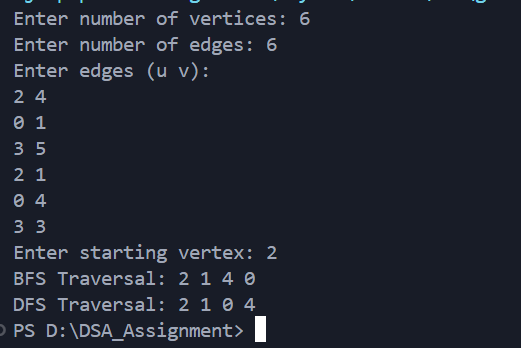

# Implementation of the BFS and DFS technique to traverse through the graph.

---

### Aim

To implement the **BFS** and **DFS** technique to traverse through graph.

The program demonstrates all operations using **function calls** and **pointer-based dynamic memory allocation**.

---

### Theory

An **undirected graph** is a set of vertices connected by edges where the connections have no direction.
Graphs can be represented in memory using:

* **Adjacency Matrix** – a 2D array where `adj[i][j] = 1` if there is an edge between vertex `i` and `j`.
* **Adjacency List** – a list of neighbors for each vertex.

This program uses a **pointer-based adjacency matrix**. BFS uses a **queue** to visit nodes level by level, while DFS uses **recursion** to explore as deep as possible before backtracking.

---

### Data Structure Definition

```c
typedef struct {
    int **adj;  // Pointer to adjacency matrix
    int n;      // Number of vertices
} Graph;
```

**Description:**

* `Graph` : Represents the undirected graph
* `adj` : Pointer to a dynamically allocated 2D adjacency matrix
* `n` : Stores the number of vertices in the graph
* `typedef` : Simplifies usage of the graph structure in the program

---

### Description of Functions

* `Graph* createGraph(int n)` : Dynamically allocates memory for a graph with `n` vertices and initializes the adjacency matrix.
* `void freeGraph(Graph* g)` : Frees all dynamically allocated memory for the graph.
* `void printGraph(Graph* g)` : Displays each vertex and its **connected neighbors**.
* `void BFS(Graph* g, int start)` : Performs **Breadth-First Search** starting from the specified vertex using a **dynamic queue**.
* `void DFS(Graph* g, int v)` : Performs **Depth-First Search** starting from the specified vertex using **recursion**.

---

### Algorithm

#### Graph Creation

1. Allocate memory for a `Graph` structure using `malloc`.
2. Set `n` to the number of vertices.
3. Allocate memory for the adjacency matrix as a 2D dynamic array.
4. Initialize all matrix elements to `0`.

#### BFS Traversal

1. Allocate a dynamic queue of size `n`.
2. Initialize all vertices as unvisited.
3. Enqueue the starting vertex and mark it visited.
4. While the queue is not empty:
   a. Dequeue a vertex `v`.
   b. Print `v`.
   c. Enqueue all unvisited neighbors of `v` and mark them visited.
5. Free the dynamic queue.

#### DFS Traversal

1. Mark the current vertex as visited.
2. Print the vertex.
3. Recursively visit all unvisited neighbors.

---

### Sample Output



---

### Result

The program successfully implements an **undirected graph** using a **pointer-based adjacency matrix** with:

* Dynamic memory allocation for graph structure and BFS queue.
* Graph display showing each vertex and its connected neighbors.
* BFS traversal showing nodes level by level.
* DFS traversal showing nodes depth-wise.

---

### Conclusion

This program demonstrates the **flexibility and efficiency of pointer-based graph representation**:

* Vertices and edges can be dynamically managed.
* Traversal algorithms (BFS and DFS) correctly explore the graph.
* Memory is dynamically allocated and freed, making the program **safe and scalable**.
