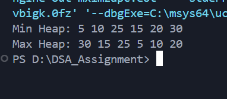

# Building Min and Max Heap Using Unsorted Array

---

## Aim

To write a C program to **construct a Min Heap and a Max Heap** from a given **unsorted array of elements** using the **heapify technique**.

---

## Theory

A **Heap** is a **complete binary tree** that satisfies a specific ordering property:

* **Min Heap**: The value of each parent node is **less than or equal to** its child nodes.
* **Max Heap**: The value of each parent node is **greater than or equal to** its child nodes.

Although a heap is conceptually a **tree-based data structure**, it is efficiently implemented using an **array**.

### Array Representation of Heap

For an element at index `i`:

* Parent index = `(i - 1) / 2`
* Left child index = `2*i + 1`
* Right child index = `2*i + 2`

This array-based representation avoids the need for pointers and ensures efficient memory usage.

---

## Heap Construction (Heapify Method)

Heap construction is performed using a **bottom-up approach** called **heapify**:

1. Convert the unsorted array into a complete binary tree.
2. Start heapifying from the **last non-leaf node**.
3. Continue heapifying each node up to the root.

The index of the last non-leaf node is:

```
(n / 2) - 1
```

This method builds the heap in **O(n)** time complexity.

---

## Algorithm

### Algorithm to Build Min Heap

1. Read the elements into an array.
2. Find the last non-leaf node.
3. Apply `minHeapify()` from that node up to the root.
4. Display the resulting Min Heap.

### Algorithm to Build Max Heap

1. Use the same input array.
2. Apply `maxHeapify()` from the last non-leaf node to the root.
3. Display the resulting Max Heap.

---

## Sample Output


---

## Time Complexity

| Operation  | Time Complexity |
| ---------- | --------------- |
| Build Heap | O(n)            |
| Heapify    | O(log n)        |

---

## Conclusion

The program successfully constructs **Min Heap and Max Heap** from an unsorted array using the **heapify technique**. The heap structure is conceptually a **complete binary tree**, but is efficiently implemented using an **array representation**.

---
