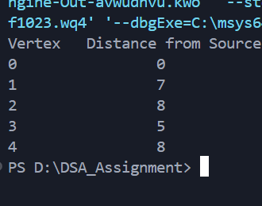

# Implementation of Dijkstra’s Algorithm in C

---

### **Aim**

To implement **Dijkstra’s algorithm** for a weighted graph to find the **shortest path from a source node to all other nodes**.

---

### **Theory**

**Dijkstra’s algorithm** is used to find the shortest paths from a single source vertex to all other vertices in a **weighted graph with non-negative edge weights**.

**Steps:**

1. Initialize distances from the source to all vertices as infinity (`INT_MAX`), except the source itself (distance = 0).
2. Select the unvisited vertex with the **minimum distance**.
3. Update the distances of its adjacent vertices (relaxation).
4. Repeat until all vertices are visited.

**Time Complexity:**

* Using adjacency matrix: **O(V²)**
* Using priority queue (min-heap): **O((V + E) log V)**

---

### **Data Structure Definition**

```c
#define MAX 10
```

**Description:**

* `MAX` : Maximum number of vertices supported in the graph.
* `graph[MAX][MAX]` : Represents the adjacency matrix of the weighted graph.
* `dist[MAX]` : Array to store the shortest distance from the source vertex.
* `visited[MAX]` : Array to keep track of visited vertices during the algorithm.

---

### **Definition of Functions**

* `int minDistance(int dist[], int visited[], int n)` : Finds the unvisited vertex with the **minimum distance** from the source.
* `void dijkstra(int graph[MAX][MAX], int n, int src)` : Implements **Dijkstra’s algorithm** to compute the shortest path from the source vertex to all other vertices.

---

### **Algorithm (Step by Step)**

1. Start with a graph `G(V, E)` with `V` vertices and `E` edges, and a source vertex `S`.
2. Create an array `dist[]` of size `V` and initialize all values to `INT_MAX`. Set `dist[S] = 0`.
3. Create a `visited[]` array to keep track of processed vertices.
4. Repeat the following until all vertices are visited:

   * Find the unvisited vertex `u` with the minimum `dist[u]`.
   * Mark `u` as visited.
   * For every adjacent vertex `v` of `u`:

     * If `v` is unvisited and `dist[u] + weight(u,v) < dist[v]`, update `dist[v] = dist[u] + weight(u,v)`.
5. After all vertices are processed, `dist[]` contains the shortest distances from the source to all vertices.

---

### **Sample Output**



---

### **Notes**

* Works only for **non-negative weights**.
* Uses **adjacency matrix** representation.
* Can be extended to **priority queue implementation** for better efficiency.

---

### **Conclusion**

Dijkstra’s algorithm efficiently computes the shortest path from a source node to all other nodes in a weighted graph with non-negative edges. It is widely used in network routing, GPS navigation, and other applications requiring optimal path finding. While simple and intuitive, its performance can be improved using data structures like min-heaps or priority queues for larger graphs.

---